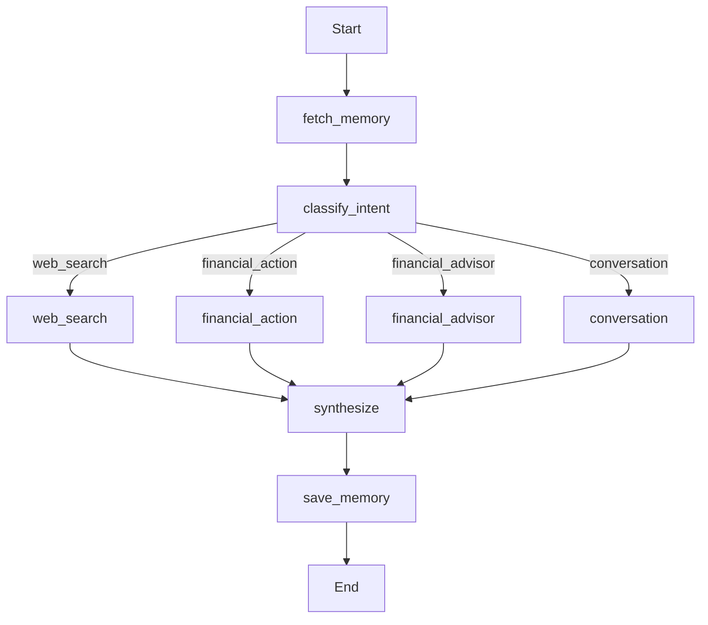

# Muneem — Agentic Personal Finance Copilot

A LangGraph-powered AI that helps you track expenses (with splits), dues, goals, and profiles, and delivers concise weekly insights grounded in your live data. Ships with a FastAPI backend, a Next.js chat UI, and optional vector memory via mem0 + Qdrant.

## Key Features (Current)

- **Agent architecture**
  - 8-node LangGraph agent: fetch_memory → classify_intent → [web_search | financial_action | financial_advisor | conversation] → synthesize → save_memory
  - Auditable runs via execution_path
  - Memory via mem0 + Qdrant (lazy-initialized)
  
- **Finance domain**
  - Expenses CRUD (with Splitwise-style splits)
  - Dues CRUD (pending/paid/overdue)
  - Goals (saving/expense)
  - User Profile (monthly_income, monthly_saving_capacity)

- **Insights grounded in DB**
  - Weekly spending, category breakdown, savings this period
  - Accumulated savings, goal progress, dues risk flags
  - AI advice that prioritizes fresh DB facts over stale memory

- **Frontend**
  - Next.js + Tailwind chat UI
  - @mention autocomplete sourced from active dues/splits

**In progress** (planned): OCR bill/receipt (image/PDF with quantity×price), QR ingestion (UPI/product), voice (Whisper + TTS), LangGraph checkpointing, Neon Postgres migration.

## Tech Stack

- Backend: FastAPI, SQLAlchemy, Pydantic v2, LangGraph, OpenAI SDK
- Memory (optional): mem0 + Qdrant
- Frontend: Next.js, TypeScript, TailwindCSS
- DB (dev): SQLite (file-backed)

## Repository Layout

```
AI-Financial-Friend/
├─ backend/
│  ├─ app/                 # FastAPI app, routes, services, models
│  ├─ requirements.txt     # Python deps
│  ├─ docker-compose.yml   # Qdrant (vector DB) service (optional)
│  └─ finance.db           # SQLite DB (dev)
├─ frontend/               # Next.js chat UI and components
├─ LANGGRAPH_ARCHITECTURE.md
└─ README.md
```

## Quickstart (Local)

### Prerequisites:
- Python 3.11+
- Node.js 18+
- An OpenAI API key

### 1) Backend (FastAPI)

Create a virtual environment and install dependencies:

```
cd backend
python -m venv .venv
# Windows (PowerShell):
.\.venv\Scripts\Activate.ps1
# Windows (cmd):
.\.venv\Scripts\activate.bat
# Unix/macOS:
source .venv/bin/activate

pip install --upgrade pip
pip install -r requirements.txt
```

Set your environment variable:

```
# Create a .env file or set the variable in your shell
OPENAI_API_KEY=sk-xxxx
```

(Optional) Start Qdrant locally for vector memory (mem0) support:

```
# from backend/
docker compose up -d
# Qdrant listens on http://localhost:6333
```

Run the API:

```
uvicorn app.main:app --host 0.0.0.0 --port 8000
# Health check: http://127.0.0.1:8000/
```

Notes:
- The default DB is SQLite at `backend/finance.db`.
- Memory features require Qdrant at `localhost:6333`. Without Qdrant, the app runs but memory-dependent calls may be no-ops or error paths depending on usage.

### 2) Frontend (Next.js)

```
cd ../frontend
npm install
```

Create `.env.local`:

```
NEXT_PUBLIC_API_URL=http://127.0.0.1:8000
```

Start the dev server:

```
npm run dev
# Open http://localhost:3000 and chat with Muneem
```

## API Overview

Base URL: `http://127.0.0.1:8000`

- **System**: 
  - GET `/` → health

- **Chat**: 
  - POST `/chat/` → chat with intent detection + actions + advice
  - POST `/chat/agent` → LangGraph agent (returns answer, intent, execution_path)

- **Expenses**: 
  - POST `/expenses/` → add expense (+ splits)
  - GET `/expenses/` → list expenses
  - DELETE `/expenses/{expense_id}`
  - GET `/expenses/insights/weekly`
  - GET `/expenses/people` → names for @mention
  - GET `/expenses/lent/unsettled`
  - GET `/expenses/lent/aggregated`

- **Splits**: 
  - POST `/expenses/splits?expense_id={id}`
  - GET `/expenses/splits/{expense_id}`
  - PATCH `/expenses/splits/{split_id}/settle`
  - DELETE `/expenses/splits/{split_id}`

- **Dues**: 
  - POST `/expenses/dues`
  - GET `/expenses/dues`
  - GET `/expenses/dues/{due_id}`
  - PATCH `/expenses/dues/{due_id}/status`
  - DELETE `/expenses/dues/{due_id}`

- **Profile**: 
  - POST `/expenses/profile`
  - GET `/expenses/profile`

- **Goals**: 
  - POST `/expenses/goals`
  - GET `/expenses/goals`
  - DELETE `/expenses/goals/{goal_id}`

### Examples

**Chat (Agent):**

```
curl -X POST http://127.0.0.1:8000/chat/agent \
  -H "Content-Type: application/json" \
  -d '{
    "message": "I spent 800 on food today",
    "refresh_context": false
  }'
# → { "answer": "...", "intent": "action", "execution_path": ["fetch_memory","classify_intent","financial_action","synthesize","save_memory"] }
```

**Add Expense with splits:**

```
curl -X POST http://127.0.0.1:8000/expenses/ \
  -H "Content-Type: application/json" \
  -d '{
    "title": "Dinner",
    "amount": 1200,
    "category": "Food",
    "splits": [
      {"person_name": "Ayush", "amount_owed": 400},
      {"person_name": "Tanmay", "amount_owed": 400}
    ]
  }'
```

## Deployment (Student-Friendly, ₹0 Infra)

Recommended for a fast, free launch:
- **Frontend**: Vercel (free). Set `NEXT_PUBLIC_API_URL=https://<your-backend-url>`.
- **Backend**: Render (free web service).
  - Build: `pip install -r requirements.txt`
  - Start: `uvicorn app.main:app --host 0.0.0.0 --port $PORT`
  - Env: `OPENAI_API_KEY`
- **Vector Memory (optional)**: host Qdrant elsewhere (another free service or a small VM) and point mem0 to it; otherwise run without memory.


Notes:

- If running without Qdrant, memory features are best-effort. The core agent, analytics, and finance CRUD continue to work.

- OpenAI usage is billed by OpenAI; use credits or set a hard spend cap.


## Architecture (High Level)



- classify_intent → routes to `web_search | financial_action | financial_advisor | conversation`
- financial_action → executes domain mutations (add_expense, add_due, add_goal, delete_*, update_profile)
- financial_advisor → generates concise guidance using live DB snapshot
- save_memory → writes short user+assistant summaries (mem0/Qdrant)
- execution_path → concatenated trail of nodes for debuggability

---

## Roadmap


- Bill/receipt parsing (image/PDF) with quantity×price line items → auto-expenses
- QR ingestion (UPI + product metadata)
- Voice interface (Whisper + TTS)
- LangGraph checkpointing (SqliteSaver/Postgres)
- Neon Postgres migration + Alembic
- Auth + multi-user isolation
- Tests, CI, and production observability

## Security & Operational Notes

- Do not commit API keys. Use environment variables.
- SQLite is fine for development; migrate to Postgres (e.g., Neon) for production.
- Restrict CORS to known frontends in production.
- Add basic rate limiting/backoff for LLM calls in production deployments.

---

## License

MIT (add a LICENSE file if needed)

---

## Acknowledgments

- LangGraph — agentic workflows